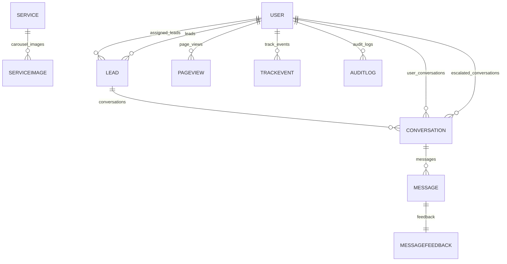

# Database Diagram - MCD Agencia (Updated 2026-04-14)

This document was rebuilt from the current Django models in:
- `backend/apps/*/models.py`

## Scope and Findings

- Total persistent models: **50**
- Apps analyzed: `users`, `catalog`, `quotes`, `orders`, `payments`, `inventory`, `notifications`, `chatbot`, `content`, `analytics`, `audit`
- Abstract base models in `core` (not DB tables): `TimeStampedModel`, `SoftDeleteModel`, `UUIDModel`, `SEOModel`, `OrderedModel`, `ERPIntegrationModel`

## Models by App

- `analytics`: 2 (`PageView`, `TrackEvent`)
- `audit`: 1 (`AuditLog`)
- `catalog`: 7 (`Category`, `Tag`, `Attribute`, `AttributeValue`, `CatalogItem`, `ProductVariant`, `CatalogImage`)
- `chatbot`: 4 (`Lead`, `Conversation`, `Message`, `MessageFeedback`)
- `content`: 11 (`CarouselSlide`, `Testimonial`, `ClientLogo`, `Service`, `FAQ`, `Branch`, `LegalPage`, `ServiceImage`, `PortfolioVideo`, `SiteConfiguration`, `PortfolioItem`)
- `inventory`: 2 (`InventoryMovement`, `StockAlert`)
- `notifications`: 1 (`Notification`)
- `orders`: 6 (`Cart`, `CartItem`, `Address`, `Order`, `OrderLine`, `OrderStatusHistory`)
- `payments`: 3 (`Payment`, `PaymentWebhookLog`, `Refund`)
- `quotes`: 8 (`QuoteRequest`, `QuoteRequestService`, `Quote`, `QuoteLine`, `QuoteAttachment`, `QuoteResponse`, `GuestAccessToken`, `QuoteChangeRequest`)
- `users`: 5 (`Role`, `User`, `UserConsent`, `UserAddress`, `FiscalData`)

## ER Diagram (Domain + Transactions)

```mermaid
erDiagram
    ROLE ||--o{ USER : role
    USER ||--o{ USERCONSENT : consents
    USER ||--o{ USERADDRESS : delivery_addresses
    USER ||--o{ FISCALDATA : fiscal_data

    CATEGORY ||--o{ CATEGORY : parent
    CATEGORY ||--o{ CATALOGITEM : items
    TAG }o--o{ CATALOGITEM : tags
    ATTRIBUTE ||--o{ ATTRIBUTEVALUE : values
    ATTRIBUTEVALUE }o--o{ PRODUCTVARIANT : attribute_values
    CATALOGITEM ||--o{ PRODUCTVARIANT : variants
    CATALOGITEM ||--o{ CATALOGIMAGE : images
    PRODUCTVARIANT ||--o{ CATALOGIMAGE : images

    USER ||--|| CART : cart
    CART ||--o{ CARTITEM : items
    PRODUCTVARIANT ||--o{ CARTITEM : cart_items

    USER ||--o{ ADDRESS : addresses
    USER ||--o{ ORDER : orders
    QUOTE ||--o{ ORDER : converted_to
    BRANCH ||--o{ ORDER : pickup_branch
    ORDER ||--o{ ORDERLINE : lines
    PRODUCTVARIANT ||--o{ ORDERLINE : order_lines
    ORDER ||--o{ ORDERSTATUSHISTORY : status_history
    USER ||--o{ ORDERSTATUSHISTORY : changed_by

    USER ||--o{ QUOTEREQUEST : requested_by
    USER ||--o{ QUOTEREQUEST : assigned_to
    CATALOGITEM ||--o{ QUOTEREQUEST : requested_item
    BRANCH ||--o{ QUOTEREQUEST : pickup_branch
    QUOTEREQUEST ||--o{ QUOTEREQUESTSERVICE : services
    BRANCH ||--o{ QUOTEREQUESTSERVICE : pickup_branch

    QUOTEREQUEST ||--o{ QUOTE : quotes
    USER ||--o{ QUOTE : customer
    USER ||--o{ QUOTE : created_by
    BRANCH ||--o{ QUOTE : pickup_branch
    QUOTE ||--o{ QUOTELINE : lines
    CATALOGITEM ||--o{ QUOTELINE : catalog_item
    BRANCH ||--o{ QUOTELINE : pickup_branch

    QUOTEREQUEST ||--o{ QUOTEATTACHMENT : attachments
    QUOTEREQUESTSERVICE ||--o{ QUOTEATTACHMENT : attachments
    QUOTE ||--o{ QUOTEATTACHMENT : attachments
    QUOTECHANGEREQUEST ||--o{ QUOTEATTACHMENT : attachments

    QUOTE ||--o{ QUOTERESPONSE : responses
    USER ||--o{ QUOTERESPONSE : responded_by

    QUOTEREQUEST ||--o{ GUESTACCESSTOKEN : guest_tokens
    QUOTE ||--o{ GUESTACCESSTOKEN : guest_tokens

    QUOTE ||--o{ QUOTECHANGEREQUEST : change_requests
    USER ||--o{ QUOTECHANGEREQUEST : reviewed_by

    ORDER ||--o{ PAYMENT : payments
    QUOTE ||--o{ PAYMENT : payments
    USER ||--o{ PAYMENT : payments
    PAYMENT ||--o{ PAYMENTWEBHOOKLOG : webhook_logs
    PAYMENT ||--o{ REFUND : refunds
    USER ||--o{ REFUND : processed_refunds

    PRODUCTVARIANT ||--o{ INVENTORYMOVEMENT : movements
    USER ||--o{ INVENTORYMOVEMENT : created_by
    PRODUCTVARIANT ||--o{ STOCKALERT : stock_alerts
    USER ||--o{ STOCKALERT : acknowledged_by

    USER ||--o{ NOTIFICATION : notifications
```

## ER Diagram (Content, Chat, Analytics, Audit)

## Table Definitions (Key Fields)

```mermaid
erDiagram
    USER {
        uuid id PK
        string email UK
        int role_id FK
        bool is_active
        bool is_staff
        bool is_deleted
        datetime created_at
        datetime updated_at
    }

    CATALOGITEM {
        uuid id PK
        string slug UK
        uuid category_id FK
        string sale_mode
        string payment_mode
        decimal base_price
        bool track_inventory
        bool is_active
        bool is_deleted
    }

    PRODUCTVARIANT {
        uuid id PK
        uuid catalog_item_id FK
        string sku UK
        decimal price
        int stock
        int low_stock_threshold
        bool is_active
        bool is_deleted
    }

    QUOTEREQUEST {
        uuid id PK
        string request_number UK
        string status
        uuid user_id FK
        uuid assigned_to_id FK
        uuid catalog_item_id FK
        uuid pickup_branch_id FK
        string delivery_method
        bool is_guest
        bool is_deleted
    }

    QUOTE {
        uuid id PK
        string quote_number UK
        uuid quote_request_id FK
        uuid customer_id FK
        uuid created_by_id FK
        uuid pickup_branch_id FK
        string status
        uuid token UK
        decimal subtotal
        decimal total
        bool is_deleted
    }

    ORDER {
        uuid id PK
        string order_number UK
        uuid user_id FK
        uuid quote_id FK
        uuid pickup_branch_id FK
        string status
        decimal subtotal
        decimal total
        decimal amount_paid
        bool is_deleted
    }

    PAYMENT {
        uuid id PK
        uuid order_id FK
        uuid quote_id FK
        uuid user_id FK
        string provider
        string status
        decimal amount
        string provider_payment_id
        datetime approved_at
    }

    NOTIFICATION {
        uuid id PK
        uuid recipient_id FK
        string notification_type
        bool is_read
        string entity_type
        string entity_id
        datetime created_at
    }
```

## Important Notes

- `Role` uses Django default integer primary key (`id`) and has `name` unique.
- Soft-delete models include `is_deleted` and `deleted_at` (from `SoftDeleteModel`).
- `QuoteAttachment` can reference 4 parents (`QuoteRequest`, `QuoteRequestService`, `Quote`, `QuoteChangeRequest`).
- `MessageFeedback` is a strict one-to-one relation with `Message`.
- `Cart` is one-to-one with `User`.
- `CatalogItem.tags` and `ProductVariant.attribute_values` are many-to-many relations.

## Delta vs Previous Diagram

Main missing or outdated pieces fixed in this version:
- Added `Notification` model and relation to `User`.
- Added `FAQ`, `SiteConfiguration`, `PortfolioItem` in content scope.
- Normalized quote service naming to `QuoteRequestService`.
- Included `QuoteChangeRequest` and its link to `QuoteAttachment`.
- Included branch links used by `QuoteRequest`, `QuoteRequestService`, `Quote`, `QuoteLine`, and `Order`.
- Explicitly documented two different address models: `Address` (orders) and `UserAddress` (users).
